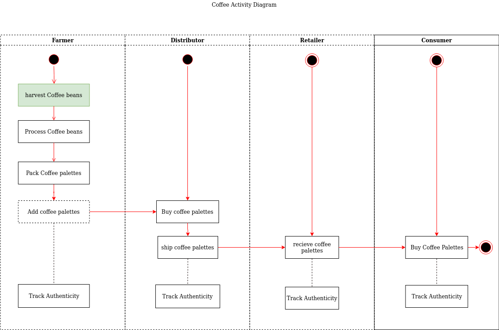
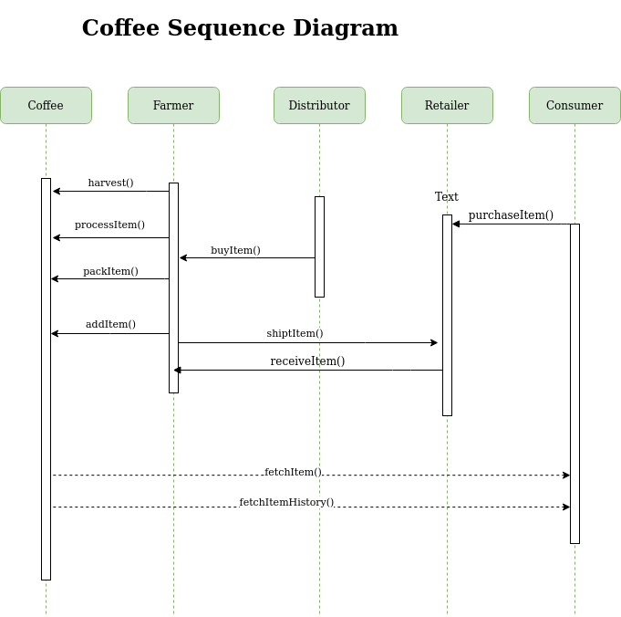
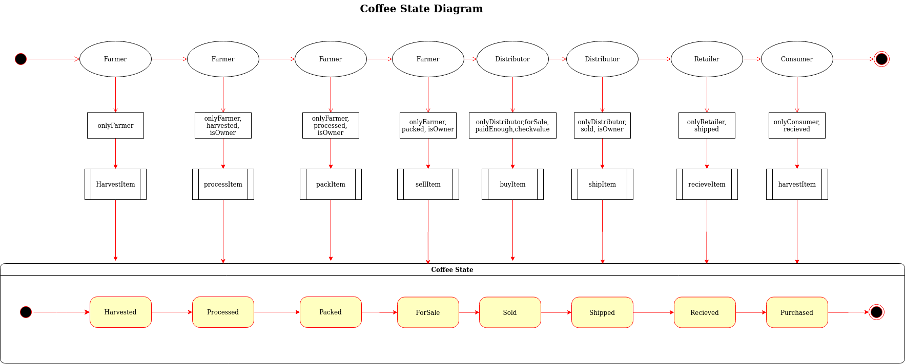

# Supply chain & data auditing

This repository containts an Ethereum DApp that demonstrates a Supply Chain flow between a Seller and Buyer. The user story is similar to any commonly used supply chain process. A Seller can add items to the inventory system stored in the blockchain. A Buyer can purchase such items from the inventory system. Additionally a Seller can mark an item as Shipped, and similarly a Buyer can mark an item as Received.

## The DApp UML: 








The DApp User Interface when running should look like...


## Getting Started

These instructions will get you a copy of the project up and running on your local machine for development and testing purposes. See deployment for notes on how to deploy the project on a live system.

### Prerequisites

Please make sure you've already installed ganache-cli, Truffle and enabled MetaMask extension in your browser.

```
* Truffle v4.1.14 (core: 4.1.14)
* Solidity v0.4.24 (solc-js)
* Ganache CLI v6.9.1 (ganache-core: 2.10.2)
* MetaMask Version 7.7.9
* NodeJs Version v12.13.1
```

### Installing

A step by step series of examples that tell you have to get a development env running

Clone this repository:

```
git clone https://github.com/udacity/nd1309/tree/master/course-5/project-6
```

Change directory to ```project-6``` folder and install all requisite npm packages (as listed in ```package.json```):

```
cd project-6
npm install
```

Launch Ganache:

```
ganache-cli -m "spirit supply whale amount human item harsh scare congress discover talent hamster"
```

Your terminal should look something like this:


In a separate terminal window, Compile smart contracts:

```
truffle compile
```

Your terminal should look something like this:


This will create the smart contract artifacts in folder ```build\contracts```.

Migrate smart contracts to the locally running blockchain, ganache-cli:

```
truffle migrate
```

Your terminal should look something like this:


Test smart contracts:

```
truffle test
```

All 10 tests should pass.


In a separate terminal window, launch the DApp:

```
npm run dev
```

## Built With

* [Ethereum](https://www.ethereum.org/) - Ethereum is a decentralized platform that runs smart contracts
* [Truffle Framework](http://truffleframework.com/) - Truffle is the most popular development framework for Ethereum with a mission to make your life a whole lot easier.
* [lite-server](https://www.npmjs.com/package/lite-server) - Lightweight development only node server that serves a web app, opens it in the browser, refreshes when html or javascript change, injects CSS changes using sockets, and has a fallback page when a route is not found.
* [truffle-hdwallet-provider](https://github.com/trufflesuite/truffle-hdwallet-provider) - HD Wallet-enabled Web3 provider. Use it to sign transactions for addresses derived from a 12-word mnemonic.


## Authors

See also the list of [contributors](https://github.com/your/project/contributors.md) who participated in this project.

## Acknowledgments

* Solidity
* Ganache-cli
* Truffle
* lite-server
* infura


## Deployment(Rinkeby)
* The contract is deployed at [0x16cd76beE63BFC240e7e6C16BA237729711c11ea](https://rinkeby.etherscan.io/address/0x16cd76bee63bfc240e7e6c16ba237729711c11ea).
```
Using network 'rinkeby'.

Running migration: 1_initial_migration.js
  Replacing Migrations...
  ... 0x1d4f99e242ce09dbeb9dd4fc73a8f764a26a22b6b0a97a4cae1d778058e451f5
  Migrations: 0x3eed8588f9fb000dbdb7ed32ca8ca0730c35f445
Saving successful migration to network...
  ... 0x2a1f25a9d5a242b97eb1b41461a84e3497d317d24526d7bba00a39a4e8b0b140
Saving artifacts...
Running migration: 2_deploy_contracts.js
  Replacing FarmerRole...
  ... 0x6996a573d9552a55e073872bd1bd77efd8bf2a0896f9d202c4cd04cc328966e3
  FarmerRole: 0x60e8b1cbe7b5f34697adc1dfac231827a49c98b3
  Replacing DistributorRole...
  ... 0xd978fe124f566b76ffb3a24784a81b178d40e83a9e32d50a1b6efbc21b815d1f
  DistributorRole: 0x710b32e0f4c9240fdf7ebb034d32f8d903b2eba8
  Replacing RetailerRole...
  ... 0xde4df1da6f1427a66a6306b8ef39b0f9d16951a83a63991d77c5f8820b1372af
  RetailerRole: 0xae9cb8c3d06425e8f318199725248f38f86cc16c
  Replacing ConsumerRole...
  ... 0x96ba8a91860ac5656ff753405795445684841087382014233936c143e339facb
  ConsumerRole: 0xa0200a9d2efa7690d8dc3625b49cd44e9621737c
  Replacing SupplyChain...
  ... 0xd00b1e40fcdeb8a9a88a3508b6b097b7d543cfd13b077682c5ae90eff250e742
  SupplyChain: 0x16cd76bee63bfc240e7e6c16ba237729711c11ea
Saving artifacts...
```

## Version:
* Truffle v4.1.14 (core: 4.1.14)
* Solidity v0.4.24 (solc-js)
